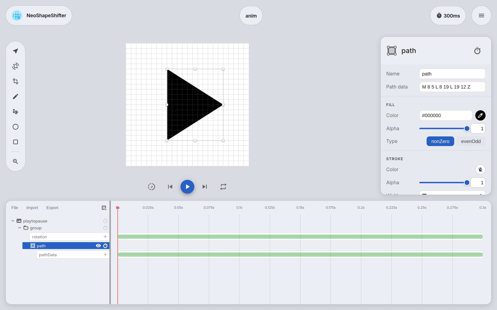
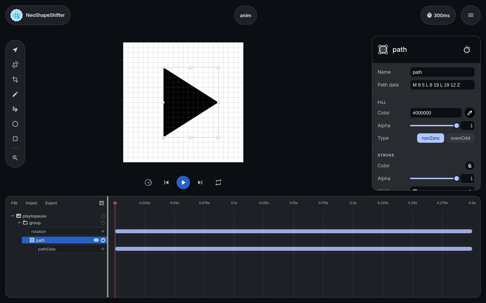
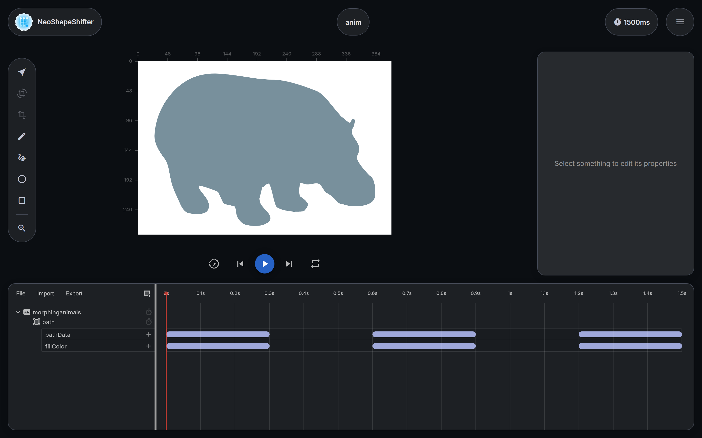

# NeoShapeShifter

NeoShapeShifter is a web app that simplifies the creation of
[icon animations][adp-icon-animations] for Android, iOS, and the web.

It is a modernized fork of [Alex Lockwood's Shape Shifter][upstream],
migrated to **Angular 19** and rebuilt with a fresh **Material 3** interface
that supports both light and dark themes.





The tool exports standalone SVGs, SVG spritesheets, and CSS keyframe
animations for the web, as well as
[`AnimatedVectorDrawable`](https://developer.android.com/reference/android/graphics/drawable/AnimatedVectorDrawable.html)
format for Android.

## What's new in this fork

Compared to the original Shape Shifter, this fork adds:

* **Angular 19 migration.** The entire app was upgraded from its legacy
  Angular version, one major version at a time, along with the surrounding
  tooling: TSLint was replaced with ESLint, `@angular/flex-layout` was
  removed, and Bugsnag was upgraded to v8.
* **Redesigned Material 3 UI.** A new "Kinetic Editor System" design language
  (see [Design.md](Design.md)) with floating glass panels, a redesigned brand
  icon, the Inter typeface, and full light/dark theme support.
* **Reworked property inspector.** Grouped properties, custom sliders,
  segmented controls, and a popover color picker with draggable thumbs and an
  explicit "no color" state.
* **Transform panel.** Scale, translate, and rotate paths numerically.
* **Keyboard shortcuts dialog** and improved playback controls.
* **Snap points to grid.** A one-click toolbar action that rounds all path
  coordinates to the nearest grid position.
* **Smarter SVG import.** Importing an oversized icon offers to resize the
  canvas down to the standard 24×24 grid.
* **Timeline improvements.** Fit-to-width minimum zoom and a cleaner header
  with a dedicated animation duration control.
* **Rendering fixes.** Correct multi-subpath rendering via compound paths and
  more robust SVG path parsing.
* **Firebase.** Google Analytics was migrated to Firebase Analytics, and the
  app deploys to Firebase Hosting.

## Example animations

Here are some example icon animations created with the tool:


The built-in demos (**File → Demo**) are a good way to explore what path
morphing can do:



## Problem

Writing high-quality [path morphing animations][adp-path-morphing]
is a tedious and time-consuming task. In order to morph one shape into another,
the SVG paths describing the two must be *compatible* with each other&mdash;that is,
they need to have the same number and type of drawing commands. This is problematic because:

* Design tools&mdash;such as [Sketch][sketch] and [Illustrator][illustrator]&mdash;do not easily
  expose the order of points in a shape, making it difficult to change their order. As a result,
  engineers will often have to spend time tweaking the raw SVG path strings given to them by
  designers before they can be morphed, which can take a significant amount of time.
* Design tools often map to shape primitives not supported in certain platforms
  (e.g. circles need to be represented by a sequence of curves and/or arcs,
  not simply by their center point and radius).
* Design tools cannot place multiple path points in the same location, a technique that
  is often necessary when making two shapes compatible with each other.
* Design tools provide no easy way to visualize the in-between states of the desired
  path morph animation.

## Features

To address these problems, NeoShapeShifter provides the following features:

* *The ability to add/remove points to each path without altering their original appearance.*
  The added points can be modified by dragging them to different positions along the path,
  and they can be later deleted using the keyboard as well.
* *The ability to reverse/shift the relative positions of each path's points.* While reordering points
  won't affect whether or not two paths are compatible, it often plays a huge role in determining the
  appearance of the resulting animation.
* *Automatic conversion of incompatible pairs of SVG commands into a compatible
  format.* There's no longer any need to convert `L`s into `Q`s and `A`s into `C`s by hand in
  order to make your paths compatible&mdash;it happens behind-the-scenes!
* *A useful utility called 'auto fix', which takes two incompatible
  paths and attempts to make them compatible in an optimal way.* Depending on the complexity
  of the paths, auto fix may or may not generate a satisfying final result, so further
  modification may be necessary in order to achieve the animation you're looking for.
* *The ability to export the results to SVG spritesheets, CSS keyframes, and
  `AnimatedVectorDrawable` format for use on the web and in Android applications.*

## How does it work?

Pretty much all of the graphics in this app are powered by bezier curve approximations under-the-hood.
Most of what you need to know is covered in this excellent [primer on bezier curves][primer-on-bezier-curves]
(especially sections 9 and 33, which explain how to split and project points onto bezier
curves without altering their original appearance). Most of the interesting SVG-related code
is located under [`src/app/modules/editor/model/paths`](src/app/modules/editor/model/paths).

Auto fix is powered by an adaptation of the [Needleman-Wunsch algorithm][Needleman-Wunsch],
which is used in bioinformatics to align protein or nucleotide sequences. Instead of
aligning DNA base-pairs, the app aligns the individual SVG commands that make up
each path instead. You can view the current implementation of the algorithm in the
[`AutoAwesome.ts`](src/app/modules/editor/scripts/algorithms/AutoAwesome.ts) file.

## Build instructions

To build and serve the web app locally:

1. Install [`Node.js`](https://nodejs.org/) and [`npm`](https://www.npmjs.com/).

2. Clone the repository and install the dependencies:

   ```sh
   npm install --legacy-peer-deps
   ```

3. Create a local Firebase config (it is gitignored because it holds your
   project's keys). Copy the template and fill in the values from the Firebase
   console, or leave the placeholders as-is for local development:

   ```sh
   cp src/environments/firebase.config.example.ts src/environments/firebase.config.ts
   ```

4. Build and serve the app:

   ```sh
   npm start
   ```

   The app is served at `http://localhost:4200`.

## Credits

NeoShapeShifter is based on [Shape Shifter][upstream] by
[Alex Lockwood](https://github.com/alexjlockwood), who also thanked
[Nick Butcher][nick-butcher-twitter], [Roman Nurik][roman-nurik-twitter],
and [Steph Yim][steph-yim-website] for their help during the early stages of
the original project. The original live version is available at
[shapeshifter.design](https://shapeshifter.design).

## License

Licensed under the Apache License, Version 2.0. See [LICENSE](LICENSE).

  [upstream]: https://github.com/alexjlockwood/ShapeShifter
  [adp-icon-animations]: http://www.androiddesignpatterns.com/2016/11/introduction-to-icon-animation-techniques.html
  [adp-path-morphing]: http://www.androiddesignpatterns.com/2016/11/introduction-to-icon-animation-techniques.html#morphing-paths
  [sketch]: https://www.sketchapp.com/
  [illustrator]: http://www.adobe.com/products/illustrator.html
  [Needleman-Wunsch]: https://en.wikipedia.org/wiki/Needleman%E2%80%93Wunsch_algorithm
  [primer-on-bezier-curves]: https://pomax.github.io/bezierinfo
  [nick-butcher-twitter]: https://twitter.com/crafty
  [roman-nurik-twitter]: https://twitter.com/romannurik
  [steph-yim-website]: http://stephanieyim.com
